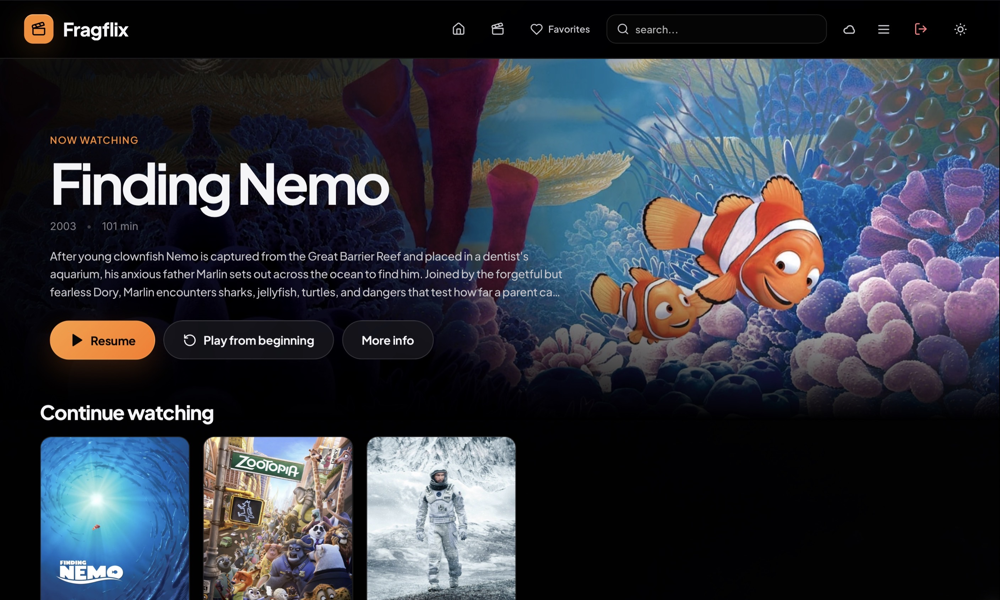
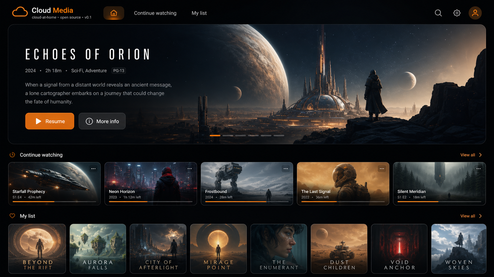
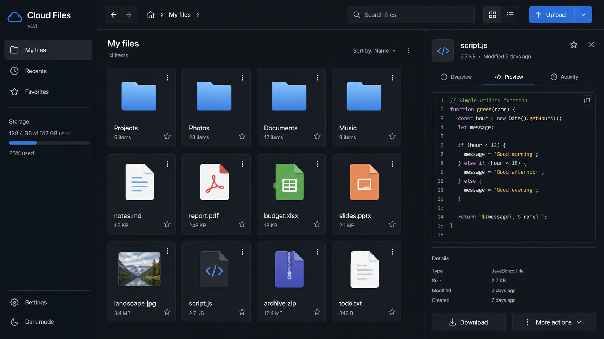
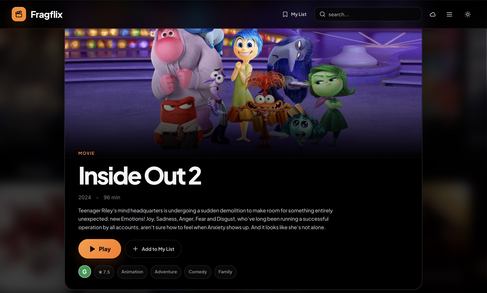

# cloud-at-home




*This image shows cloud-at-home’s video application, running on the developer’s home server deployment.*

Private-first, self-hosted cloud applications backed by established services:

- **Cloud Media** — a custom Jellyfin client with profiles, resume history, responsive playback, configurable subtitles, favorites, named lists, and library search
- **Cloud Drive** — Finder-style FileBrowser client with Monaco editing, previews, transfers, user controls, and recoverable trash
- **Service switcher** — navigation between media, files, local AI, and optional runtime-configured services
- **Gateway** — encrypted upstream sessions, scoped proxy policies, preferences, playback tickets, and trash metadata

## Preview

The interface previews below combine generic product captures with clearly
labelled images from a real home-server deployment. Runtime credentials,
hostnames, routes, and configuration are never included in the repository.

### Cloud Media



*Browse and play a media library from the responsive Cloud Media interface.*

Browse, search, and play movies and television from a responsive streaming interface.
The current client includes type-ahead title search, favorites and named lists,
watch-history controls, series navigation, metadata ratings, configurable
captions, playback diagnostics, and desktop/iOS-oriented player behaviour.

---

### Cloud Drive



*Manage files from the Finder-style Cloud Drive interface.*

Browse, preview, edit, transfer, and recover files from a Finder-style interface.

---

### Home server deployment



*Cloud Media running on the developer’s home server deployment.*

The stock services remain the data, authentication, and permission authorities.
Runtime credentials, databases, hostnames, media, and machine-specific service
routing stay outside Git. The repository ships generic configuration templates
so a deployment can be reproduced without publishing its private state.

## Development

```bash
npm install
python3 -m venv gateway/venv
gateway/venv/bin/pip install -r gateway/requirements-dev.txt
npm test
gateway/venv/bin/python -m pytest gateway/tests
```

Run the gateway with the environment described in `deploy/.env.example`, then:

```bash
npm run dev:media
npm run dev:files
```

## Staging deployment

`deploy/compose.yaml` intentionally leaves the stock FileBrowser service on
`:8080`. Cloud Media runs on `:8090` and Cloud Drive on `:8082` by default.

```bash
gateway/venv/bin/python deploy/init_runtime.py
docker compose -f deploy/compose.yaml up -d --build
```

Rollback is `deploy/rollback.sh`; it stops only Cloud Drive staging.

## Publishing model

The public repository contains only generic source, fixtures, and examples.
Deployment-specific branding, routes, credentials, media, and host configuration
belong in ignored runtime state or a separate private deployment checkout.

## v0.2

- richer Cloud Media playback controls, diagnostics, subtitles, resume handling,
  series navigation, ratings, My List, and cinema mode
- polished Cloud Drive identity, Finder-style browsing, drag-and-drop, downloads,
  Monaco-based editing, broader previews, user administration, logout, and trash
- stronger session recovery, preference normalization, playback reporting, and
  FileBrowser 2.63-compatible resource mutations
- substantially expanded unit, gateway, and desktop/iPad regression coverage

### Since v0.2

- replaced the single saved-items shelf with Favorites and user-named lists,
  including a selectable list promoted into the navigation bar
- added type-ahead title suggestions and clearer movie/TV library organization
- refined classification, audience, and critic metadata presentation
- expanded subtitle styling, playback diagnostics, seek previews, iOS playback
  handling, pause-state presentation, and player control behaviour
- tightened responsive card rails, artwork rendering, and detail layouts
