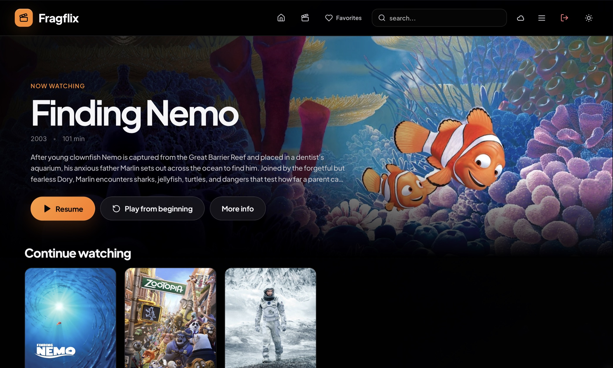
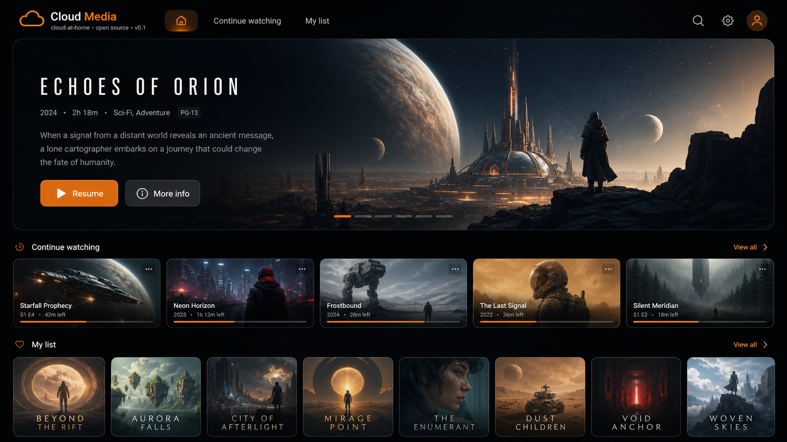
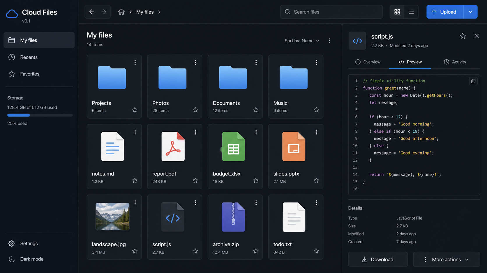
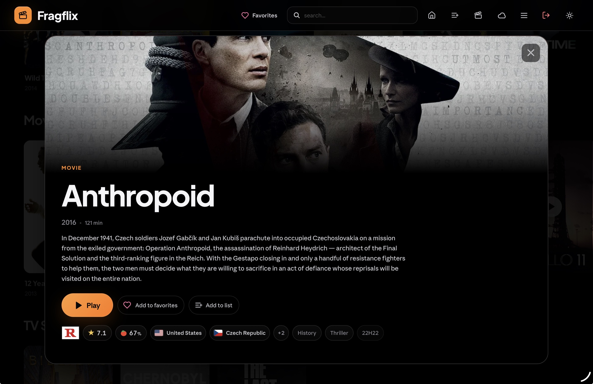

# cloud-at-home




<sub><em>The Video interface running against a self-hosted media library.</em></sub>

Self-hosted web applications backed by established services:

- **Video** — a custom Jellyfin client with profiles, resume history, lists, subtitles, keyboard controls, responsive fullscreen, bounded HLS streaming, and faithful regional classification marks
- **Cloud Drive** — a Finder-style FileBrowser client with editing, previews, bulk selection, transfers, quick-access pins, file details, shared media lightboxes, and recoverable trash
- **Photos** — a responsive photo timeline with albums, search, deep-linked lightboxes, direct uploads, Drive imports, and library organization tools
- **Service switcher** — shared navigation and themes across Video, Drive, Photos, local AI, and optional services
- **Gateway** — encrypted upstream sessions, scoped read/write proxy policies, preferences, playback tickets, same-origin media delivery, and session recovery

## Preview

### Video



<sub><em>Browse, search, and play a media library from a responsive interface.</em></sub>

### Cloud Drive



<sub><em>Preview, edit, transfer, and recover files from a Finder-style interface.</em></sub>

### Video details



<sub><em>Rich metadata, regional classification marks, and playback controls without leaving the library.</em></sub>

## Architecture

The React applications authenticate through a Flask gateway. Jellyfin and
FileBrowser remain the authorities for users, permissions, media, and files.

```text
Browser -> Video ---------> Gateway -> Jellyfin
        -> Drive / Photos -> Gateway -> FileBrowser
                             Gateway -> SQLite
```

## Run locally

```bash
npm install
python3 -m venv gateway/venv
gateway/venv/bin/pip install -r gateway/requirements-dev.txt
npm test
gateway/venv/bin/python -m pytest gateway/tests
npm run dev:media
npm run dev:files
npm run dev:photos
```

## Deployment

Copy `deploy/.env.example` to the ignored runtime configuration, initialize the
runtime directory, and start the stack:

```bash
gateway/venv/bin/python deploy/init_runtime.py
docker compose -f deploy/compose.yaml up -d --build
```

Rollback is `deploy/rollback.sh`; it stops only Cloud Files staging.

## Public-source safety

The repository uses neutral product names and must not inherit deployment-only
branding, hostnames, URLs, credentials, or personal data. Run
`npm run check:public` before committing; the same check runs in CI and as part
of `npm test`.

## License

MIT. See [LICENSE](LICENSE).
